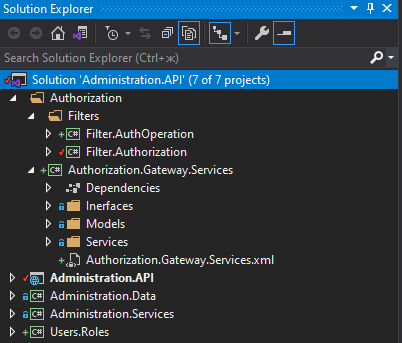

# UNIVERCITY-CORE
 Переводим потихоньку портал универа на ASP.NET CORE 5.0.

## AUTHORIZATION ##

Сервис авторизации.

Microsoft.Identity авторизация и аутентификация по токенам JWT:

запросы должны иметь заголовок с ключом Authorization и со значением в формате "Bearer: токен авторизации".

Имеет Web Api для управления пользователями и их профилями, а так же Web Api для аутентификации и авторизации со стороны внешних приложений.

Получение токена:

```
  api/login
```
  
В ответе поле Token содержит строковое представление JWT токена авторизации.

Поле RefreshToken содержит ключ для восстановления токена.


Восстановление токена:

```
  api/refresh-token
 ```
  
В ответе строка с токеном авторизации.

После получения токена все запросы должны содержать заголовок с ключом Authorization и со значением в формате "Bearer: токен авторизации".

Все запросы к сервису авторизации локализуются праметром "culture", например, "culture=ru".

<b>Программная реализация авторизации пользователя из приложения на примере сервиса Administration:</b>



Авторизацию обеспечивают библиотеки:

```
     Filter.AuthOperation - реализует поддержку токенов в Swagger.
     Filter.Authorization - реализует поддержку двух пользовательских 
                            атрибутов авторизации: [AuthorizationWithRoles(string role)]
                            и [IsAuthorized], использующих интерфейс IAuthorizationGateway
                            для запроса авторизации.
     Authorization.Gateway.Services -
                            предоставляет интерфейс IAuthorizationGateway.
                            Реализация интерфейса представлена двумя классами:
                            AuthorizationGatewaySignalR - авторизация с помощью SignalR;
                            AuthorizationGatewayHttp - авторизация через запрос к Web Api.
   ```

Все запросы направлены к сервису авторизации.

Настройки в appsettings.json:

Использовать для авторизации запросы к хабу SignalR или к функции Web Api:

```
UseSignalR : true|false
```
Url адреса хаба или Web Api:

```
"UrlSettings": {
    //"IsUserInRoleUrl": "https://localhost:5001/TokenValidation/IsUserInRole",
    //"IsUserAuthorizedUrl": "https://localhost:5001/TokenValidation/IsUserAuthorized",
    "IsUserInRoleUrl": "https://localhost:5001/api/isuserinrole",
    "IsUserAuthorizedUrl": "https://localhost:5001/api/isuserauthorized"
  }
 ```
 
 где "TokenValidation" - точка входа хаба.
 
 Внедрение зависимостей:
 
 ```
UrlSettings configuration = new UrlSettings();
Configuration.GetSection("UrlSettings").Bind(configuration);
services.AddSingleton(configuration);
//
if (Configuration["UseSignalR"].ToLower().Equals("true"))
{
     services.AddSingleton<IAuthorizationGateway, AuthorizationGatewaySignalR>(); //signalR. 
} else
{
     services.AddSingleton<IAuthorizationGateway, AuthorizationGatewayHttp>(); //Web Api.
}
//
```

Для поддержки в Swagger добавить в services.AddSwaggerGen
```
c.OperationFilter<AuthOperationFilter>();
```

Далее в контроллерах применяем атрибуты "[AuthorizationWithRoles(string role)]" или "[IsAuthorized]".


## ADMINISTRATION ##

Сервис управления административным корпусом (создание, редактирование, получение списков подразделений (отделов), не связанных непосредственно с учебным процессом.

## UTILS ##

Библиотеки.

